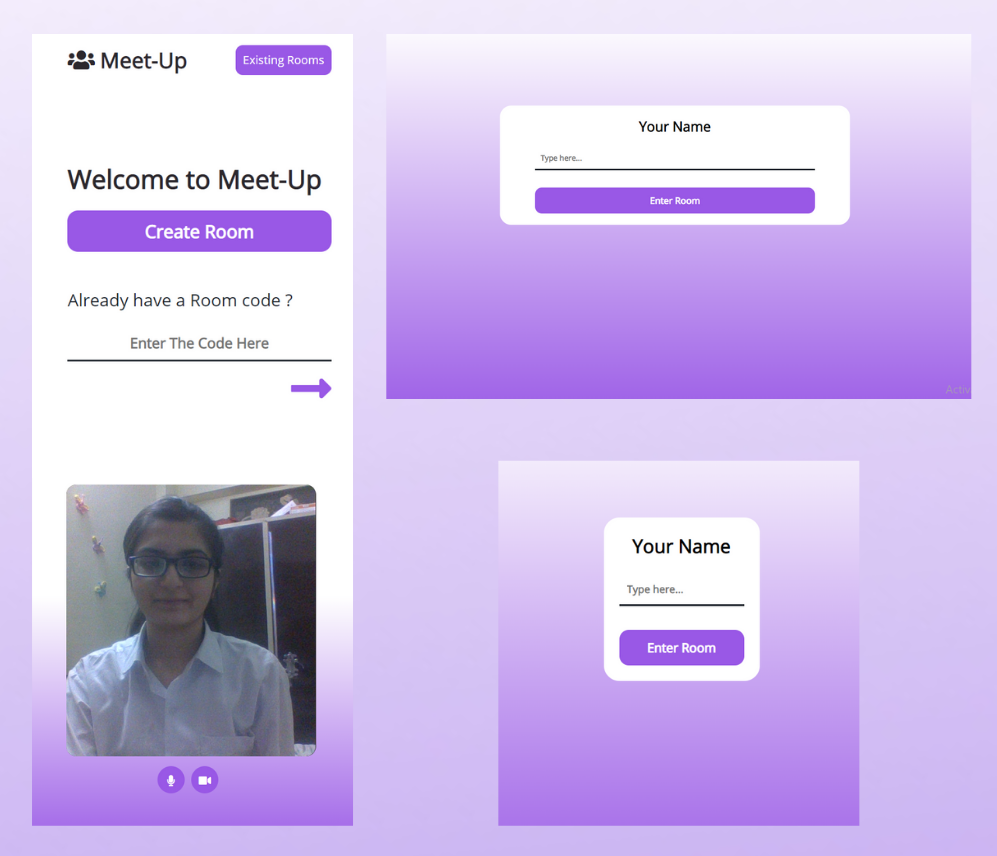
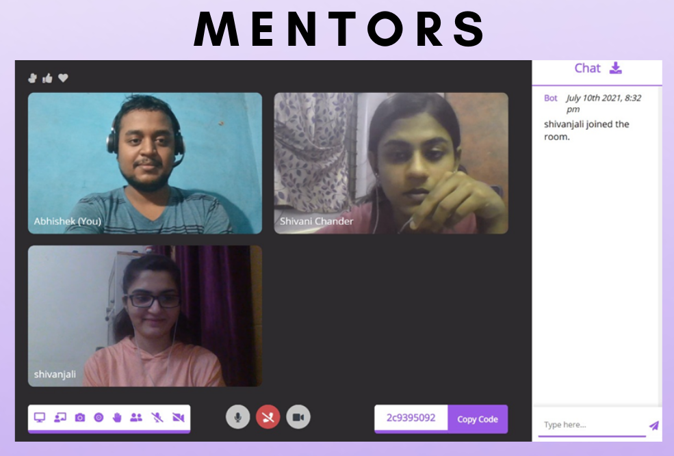
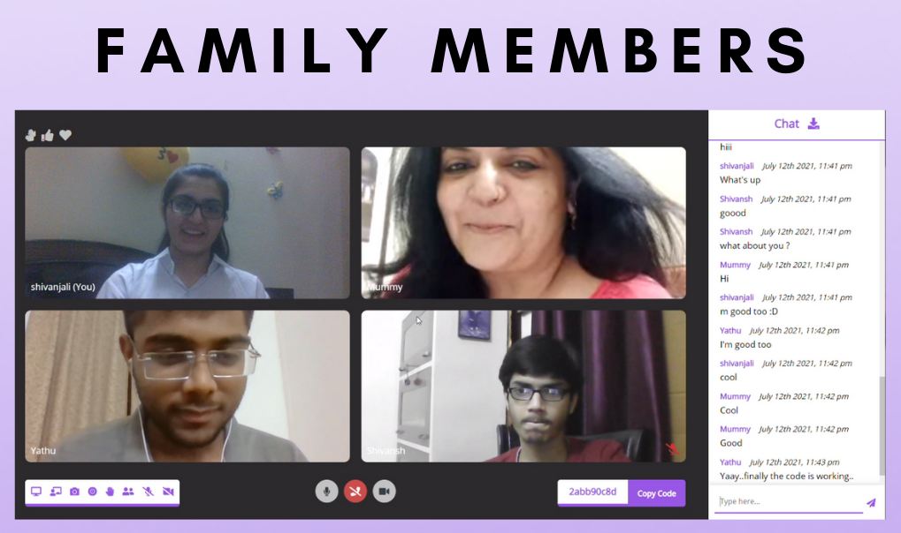
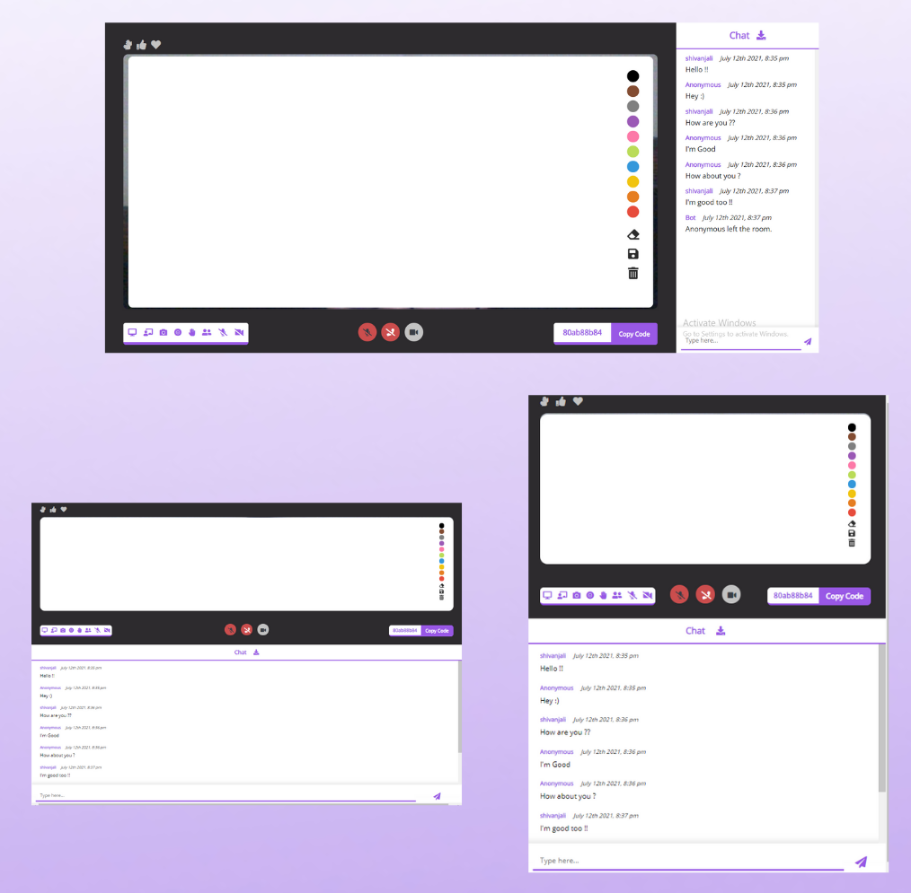

# 👥 Meet-Up
#### Meet-Up is a "Microsoft Teams Clone" Web Application built under Microsoft Engage Mentorship Program 2021.

## Features of "Meet-Up"
- Video conferencing with **no limit for the number of participants**
- Talk endlessly ( no upper limit for call duration )
- **Create Rooms** by generating random Room Code & **Copy Room Code** for sharing with people
- **Join a Room** by simply entering the Room Code
- **Audio Toggle** - Mute / Unmute Mic 🎤
- **Video Toggle** - Hide / Unhide Video 📷
- **Text Chat** with all participants ( messages sent are all saved and the conversation can be continued anytime ✌️ )
- **Auto Scroll** for chat messages
- **Download Chat** 📥 ( All chat messages along with sender’s name & date-time can be downloaded in .TXT file with just one click )
- Joining / Leaving of participants is **notified** in the Chat by "Bot" 🤖
- **Screen Sharing** - Share your screen / chrome tab / window with all the participants 💻
- **Video Stream ( with audio ) Recording** - automatic download to system upon stopping recording 📹
- **Entire Screen Recording** - automatic download to system upon stopping recording ⏺️
- **Raise Hand** ✋ ( Notifies all the participants with a beep along with the hand visible in your video stream )
- **Whiteboard** - A collaborative whiteboard which can be erased, entirely cleared and even downloaded as an image ✏️ 
- **Mute Incoming Audios** 🎧 ( All other participants' audio will be muted for you but not for others )
- **Hide Incoming Videos** ❌ ( All other participants' video will be hidden for you but not for others )
- **Send Reactions** ( Notifies all the participants with a beep and Your reaction ( ❤️, 👍 , 👏 ) is visible to all the participants for few seconds and then disappears )
- **Download Attendees Activity** 📥 ( Information about which participant joined the current conference at what time and left at what time can be downloaded as a .txt file )
- Completely **Responsive** for mobile devices ✔️

## *IDEA* behind adding some Paricular Features / Driving Forces
### **1. Download Chat Feature**
If a professor uses the product and he/she wants to save all the "in chat" discussions locally in his system, he/she can simply download the chat messages along with date, time and sender's name in one click ( instead of copy-pasting the entire chat )
### **2. Whiteboard**
In the era of everything being online, a feature like collaborative whiteboard is surely a useful one. It can be used to explain stuff to other participants in the room or simply as a relaxation tool ( playing [scribble](https://skribbl.io/) or doodling )
<br><br>
*Everything on the board can be easily downloaded as an image in one click. A better UX as now the user doesn't need to take screenshots ( if needed )*

### **3. Video Stream Recording**
There might be a case where an instructor wants to record the session but not the entire screen, just the content he delivered in the session. That's where the necessity of this feature arrises. 
### **4. Hiding Incoming Videos / Muting Incoming Audios**
Surely a very useful feature in *Microsoft Teams* as it ensures that we can opt to hide/unhide ( mute/unmute ) remote video (audio) streams according to our internet connection / distraction level.
*Useful when a speaker in the room wants to avoid any kind of disturbance.*
### **5. Download Attendees Activity**
The person who starts the meeting / creates the room may want to keep a record of which participant joined/left at what time, or, simply track the attendance. This feature allows to download all this activity in one click.

## Deployment 
🚀 Here's the link of the web application ( deployed on heroku ) 🚀
- https://meetsmadeeasy.herokuapp.com/

## Video Demonstration 
🚀 Here's the link to the video demonstration of Meet-Up 🚀
- https://vimeo.com/574326164

# Approach Towards Building the Project
### Development Methodology - Scrum Methodology
**Agile Scrum Methodology** is basically incremental development i.e. we build the product in iterations, step by step. <br><br>
We work in “Sprints” where each sprint lasts for a week or two, and focus on building the important features first and then improve the product to make it more potential.

### Here are the sprints I had set for myself for the 4 week journey 😄

#### WEEK 0 ( INITIAL DAYS )
1. **Learning** more about Backend Development
2. **Researching** about how video conferencing apps work ; what technologies / APIs / SDKs are used
3. **Deciding the Tech Stack** and finding suitable resources
4. **Designing** my product (using [Canva](https://www.canva.com/) )

#### WEEK 1 ( BUILD PHASE )
1. Setting up the server and adding the functionality to access the webcam and microphone to stream my own video
2. Connecting other clients to have a simple video call **( MINIMUM REQUIRED FUNCTIONALITY )**
3. Adding Video/Audio Toggle Buttons
4. Adding features that may enhance **User Experience** ( Adding Create Room / Copy Room code Feature )
5. **Styling and Testing**
<br>

**ISSUES :**
Setting a custom Room Name corresponding to Room Code every time a new Room is created **( not implemented as of now, But sure of doing it in near future )**

#### WEEK 2 ( BUILD PHASE )
1. Adding **Basic Chat Feature** - send and view messages along with the sender’s name and the time at which message is sent.
2. Adding features which are included in almost all video conferencing apps – Screen Sharing, 'Screen / Video Stream' Recording
3. Adding Hand Raise Feature
4. Taking inspiration from Microsoft Teams – Adding ability to send reactions, Mute incoming videos / audios
<br>

**ISSUES :**
Adding EmojiPicker in Chat **( not implemented as of now, But sure of doing it in near future )**

#### WEEK 3 ( X-FACTOR TIME )
1. **Examining** and planning useful features for Meet-Up
2. Adding Whiteboard ( A really useful feature which can be used to clear friends’ doubts or simply play [scribble](https://skribbl.io/) )
4. Adding **easy yet useful features** – Saving whiteboard as an image / downloading chat messages / downloading attendees activity
5. Making the product **Responsive and Improving UI/UX**
<br>

**ISSUES :**
Ability to Draw on Whiteboard using Screen Touch **( not implemented as of now, But sure of doing it in near future )**

#### WEEK 4 ( ADAPT PHASE )
1. Attaching database ( [MongoDB Atlas](https://www.mongodb.com/) ) to persist messages in order to continue conversation anytime later **( TRYING TO IMPLEMENT SURPRISE FEATURE )**
3. Adding user authentication ➡️ displaying the list of Rooms a user is part of on the Landing page itself
**( not implemented as of now, But sure of doing it in near future )**
4. **Deploying the application** on Heroku – Main motive being, taking inputs from family members, friends and mentors - What improvements can be made
5. **Improving UI/UX** on the basis of reviews from family members, friends and mentors.
6. Working on making Video Demo & updating README.md

## SNAPSHOTS






## Libraries and Dependencies
The project “Meet-Up” is built using HTML, CSS, Javascript & NodeJS using webRTC
- [socket.io](https://www.npmjs.com/package/socket.io)
-	[moment-timezone](https://www.npmjs.com/package/moment-timezone)
- [nodemon](https://www.npmjs.com/package/nodemon)
-	[express](https://www.npmjs.com/package/express)
-	[dotenv](https://www.npmjs.com/package/dotenv)
-	[mongoose](https://www.npmjs.com/package/mongoose)

## How to Run this Project Locally
- Clone the given repository
```bash
$ git clone https://github.com/Shivanjali-12/Meet-Up.git
```
- Run the command npm install in your terminal in the root directory of the project to install the various dependencies
```bash
npm install
```
- You'll have to setup your mongoDB database for the project. For that create an account on [MongoDB Atlas](https://www.mongodb.com/). 
  Remember your credentials like **Username** & **Password**.
- Create a database. Remember the name of your **Database**.
- Create a .env file in the root directory of the project using the touch command in your terminal
```bash
touch .env
```
- Add the following code in the .env file
```bash
ADMIN = <YOUR USERNAME>
PASSWORD = <YOUR PASSWORD>
DBNAME = <NAME OF YOUR DATABASE>
```
- Use the commant node server.js to run the app locally.
```bash
node server.js
```

- The server will listen on PORT 3000 ( localhost:3000 )

## Future Enhancements planned for "Meet-Up"

### - Take constant feedbacks and suggestions from friends and family

### - Try to refine the features from ***"Improvement"*** point of view
1. *Screen Sharing can be improved to be visible on full screen*
2. *Share Room link / Room Code directly from the app*
3. ***"Download Attendees Activity"** downloads only the activities prior to you joining, can be further extended to downloading the activities since the beginning of meeting*

### - Work on implementing the features planned earlier
1. *Adding EmojiPicker in chat*
2. *Adding feature that will allow a user to draw on whiteboard using screen touch*
3. *Feature for Setting a custom Room Name corresponding to Room Code every time a new Room is created*
4. *Adding user authentication ➡️ displaying the list of Rooms a user is part of on the Landing page itself*